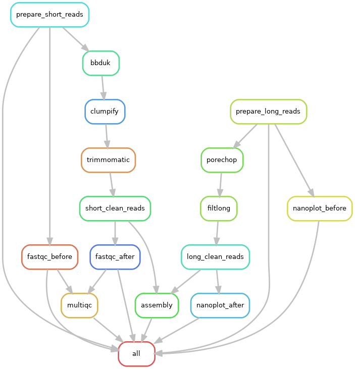
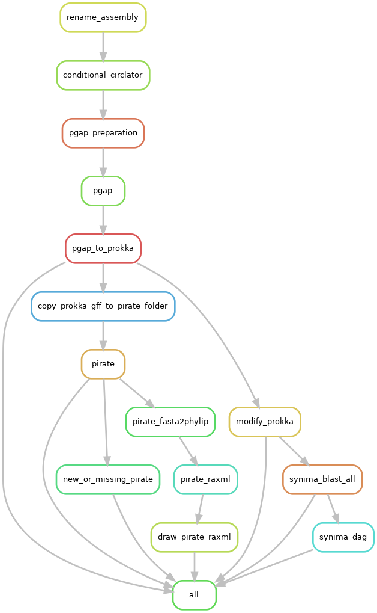

# Genomic analyses
Genome creation for *Parvimonas micra* isolates and phylogenomic/synteny analyses.

- [Requirements](#requirements)
- [Assembly creation](#assembly-creation)
- [Comparative analysis](#comparative-analysis)
    - [Better annotations, phylogenomics and synteny](#better-annotations-phylogenomics-and-synteny)
    - [More synteny with Sibelia and Circos](#more-synteny-with-sibelia-and-circos)
    - [OrthoANI](#orthoani)
    - [SNPs and mutations](#snps-and-mutations)
    - [Virulence](#virulence)
    - [Prophages and CRISPR analysis](#prophages-and-crispr-analysis)

## Requirements
Each step will have different requirements, but a base environment will be used to run the Snakemake and Python scripts. You will need also have Conda/Mamba installed (with mamba being highly recommended).

```sh
mamba create -n snakemake_env
conda activate snakemake_env
mamba install snakemake==7.18.2 python==3.8.10 pandas==1.5.0 numpy==1.23.1 colorama matplotlib seaborn
```

## Assembly creation
The script `genomics/assembly/snakemake.smk` was used to run the assembly process.  It cleans both short and long reads and performs hybrid assembly. Variables are configured at the top of the script in `Config variables` section.

The structure of the input read folders should be:

- Short paired end reads (Illumina): `path/sr_reads/{sample_id}/{sample_id}_R{1,2}.fastq.gz`
- Long reads (Oxford Nanopore): `path/lr_reads/{sample_id}/{sample_id}.fastq.gz`


To previsualize steps:
```sh
# Move to folder where snakemake.smk is
cd genomics/assembly

# Set up variables at the beginning of this script
# "genomics/assembly/snakemake.smk"

# Activate environment
conda activate snakemake_env

# Previsualize
snakemake -s snakemake.smk --use-conda -c12 -np

# Draw workflow (if you want)
snakemake -s snakemake.smk -np --rulegraph | dot -Tpng > dag.png
```


<p align="center">
  
</p>

If everything is ok, the workflow can be run by removing the `-np`. Snakemake will install the necessary environment using conda:
```sh
conda activate snakemake_env
snakemake -s snakemake.smk --use-conda -c12
```

## Comparative analysis

### Download reference genomes

The genomes created in this study are available at **PRJNA857572** and referenced in the paper, together with the extra genomes in NCBI used for phylogenomic analysis.

### Better annotations, phylogenomics and synteny

A custom script for the paper will be ran on these assemblies and all non-metagenomic reference genomes for *Parvimonas micra*. The script will fix the start of all genomes (if thery are circular), annotate them with PGAP and perform phylogenomic analyses. This part requires a pretty powerful computer due to PGAP's annotation and phylogenomic analysis with RAxML. High amounts of RAM and threads is recommended.

Set up the variables at the beginning of the script `genomics/comparative_genomics/pgap/parvimonas.smk`, with the input being the folder with all assemblies ending in ".fasta". A PGAP installation (https://github.com/ncbi/pgap), PGAP data (`input-2022-02-10.build5872`) and Synima (https://github.com/rhysf/Synima) must also be given here.

```sh
# Move to folder
cd genomics/comparative_genomics/pgap

# Set up variables at the beginning of this script
# "genomics/comparative_genomics/pgap/parvimonas.smk"

# Activate snakemake env
conda activate snakemake_env

# Check everything first
snakemake -s parvimonas.smk --use-conda -c60 -np

# Run script
snakemake -s parvimonas.smk --use-conda -c60
```

<p align="center">
  
</p>

Once the script has finished, the folder will contain:
- Annotated assemblies using PGAP.
- Annotated assemblies transformed to Prokka format (some tools require this specific format, which somewhat varies).
- PIRATE output (presence absence of genes).
- Synteny output (genomic order between assemblies).
- Phylogenomic tree using PIRATE's pangenomic alignment and RAxML


### More synteny with Sibelia and Circos
Another Synteny analysis was made with Sibelia to draw pairwise Circos plots. The script `genomics/comparative_genomics/sibelia/sibelia.smk`, which input is a folder of circularized genomes that end in suffix `*.fna`, will create pairwise circos plots using multiple window sizes without reciprocal hits (conections inside a genome). To run:

```sh
# Set up variables at the beginning of this script
# "genomics/comparative_genomics/sibelia/sibelia.smk"

# Move to location of script
cd genomics/comparative_genomics/sibelia

# Activate snakemake env
conda activate snakemake_env

# Check everything first
snakemake -s sibelia.smk --use-conda -c60 -np

# Run script
snakemake -s sibelia.smk --use-conda -c60
```


### OrthoANI

Download and set-up OrthoANIU (https://www.ezbiocloud.net/tools/orthoaniu) and run:

```sh
ortho_ani_u_path="" # path to OrthoAniU program
usearch_path="" # path to usearch program
input_folder="" # path to folder with assemblies/genomes in FASTA format
output_res="" # a .txt file

java -jar $ortho_ani_u_path -u $usearch_path -fd $input_folder -o $output_res -fmt list -n 12
```

Process and plot the result with `genomics/comparative_genomics/ani/ani_plot.py` to see the supplementary heatmap figure.


### SNPs and mutations

Install Snippy 4.6.0 and use the code in `genomics/comparative_genomics/snippy/snps.py` to do pairwise comparisons and get the comparisons stats. 

### Virulence
Virulence factor analysis was performed using DIAMOND against the Virulence Factor Database (VFDB), the code is available at `genomics/comparative_genomics/virulence/virulence.py`. 

### Prophages and CRISPR analysis

CRISPR arrays in *Parvimonas micra* isolates were studied due to some interesting findings, but it is a more manual proccess.

#### Download CRISPR arrays
Firstly, CRISPR-Cas were extracted from circularized genomes using [CRISPRminer](http://www.microbiome-bigdata.com/CRISPRminer/index.php/Home/Index/index). These results are the starting point and are located at `genomics/comparative_genomics/crisprs/data/extracted_crispr_arrays.zip`:

```sh
# Unzip the results
cd genomics/comparative_genomics/crisprs/data
unzip extracted_crispr_arrays.zip

# Merge crispr spacers
cd results
cat */crispr.fasta > merged_spacers.fasta
```

Each folder belongs to a sample id and contains `cas.fasta` (CAS proteins in FASTA format), `cas.txt` (positions and classification of CAS proteins), `crispr.fasta` (CRISPR spacers in FASTA format), `res.txt` (CRISPR arrays information, with spacers and repeating regions).

#### Download phage databases
Download Oral Virus Database (OVD) and Gut Phage Database (GPD).

```sh
# Create databases dir
cd genomics/comparative_genomics/crisprs/data
mkdir dbs && cd dbs

# Download OVD from https://github.com/RChGO/OVD
mkdir -p ovd && cd ovd
wget https://github.com/grc145/Temp/raw/master/OVD-genomes.fa.bz2 # genomes
wget https://github.com/grc145/Temp/raw/master/OVD-info.xlsx # metadata
bzip2 -d OVD-genomes.fa.bz2
cd ..

# Download GPD from http://ftp.ebi.ac.uk/pub/databases/metagenomics/genome_sets/gut_phage_database/
mkdir -p gpd && cd gpd
wget http://ftp.ebi.ac.uk/pub/databases/metagenomics/genome_sets/gut_phage_database/GPD_sequences.fa.gz # genomes
wget http://ftp.ebi.ac.uk/pub/databases/metagenomics/genome_sets/gut_phage_database/GPD_metadata.tsv # metadata
gzip -d GPD_sequences.fa.gz
cd ..

# Merge sequences (to use as blast database)
mkdir -p gpd_ovd
cat ovd/*.fa gpd/*.fa > gpd_ovd/ovd__gpd.fasta

```

#### Spacers and prophage analysis

Spacers retrieved in the previous steps were blasted against Oral Virus Database (OVD) and Gut Phage Database (GPD) to try to find which phages were those spacers defending *Parvimonas micra* from. This was done to see if the spacers gained in PM89KC-AC-1 in respect to PM89KC-G-1/2 were linked to gut or oral phages. The idea is to see if PM89KC-AC-1 could have gained defenses against gut phages in its translocation to the area. 

The left prophage of PM89KC-AC-1 was also blasted against these databases in order to find matching prophages.

Addittionally, spacers were blasted against themselves to find which ones are shared between each isolate. This was done specifically to see the relation of the spacers in PM89 isolates.

You can see the code for all of this in `genomics/comparative_genomics/crisprs/crispr_spacers.py`.

#### Left prophage vs right prophage
A DIAMOND analysis was made on the proteins of the left and right prophages of PM89KC-AC-1 in order to see their level of pairwise identity. The proteins for these prophages are available at `genomics/comparative_genomics/crisprs/data/cross` and the code is available at `genomics/comparative_genomics/crisprs/cross_blastp.py`.


